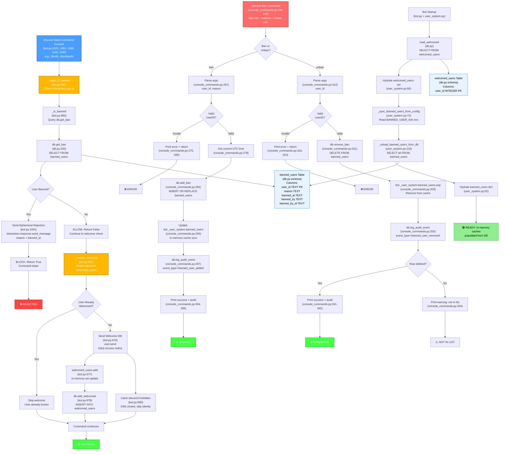

# User Tracking & Enforcement Feature — Mermaid Flowchart

## Flowchart: User Ban Enforcement & Welcome System

---

## External Dependencies

| Dependency | Purpose | Location |
|---|---|---|
| **Discord.py** | Interaction handling, DM sending, ephemeral messages | `bot.py`, `discord` module |
| **aiosqlite** | Async SQLite connection pooling | `db.py`, `Features/Core/db/` |
| **datetime, timezone** | UTC timestamp generation for ban records | `console_commands.py:20` |
| **Config** | `BANNED_USER_IDS` at startup | `Features/Core/config/config.py` |
| **DB Schema** | `banned_users` and `welcomed_users` tables | `db.py:_SCHEMA` |

---

## Key Data Flows

### 1. Ban Check on Command (Lines 987–1009, 1023–1026)
- **Trigger**: Every slash command (`/ttrinfo`, `/doodleinfo`, etc.)
- **Check**: `_is_banned()` → `db.get_ban(user_id)` → SQLite query
- **Result**: If banned, send ephemeral rejection; if not, continue to welcome check
- **Caching**: `db.get_ban()` is non-cached (always queries DB); in-memory `banned_users` dict in `user_system.py` exists but is not currently used in the command path

### 2. Welcome DM on First Command (Lines 961–981, 1026)
- **Trigger**: Immediately after ban check passes
- **Check**: `user.id in self.welcomed_users` (in-memory set)
- **Action**: If not in set, send DM, add to set, persist to DB
- **Handling**: Catches `discord.Forbidden` (DMs closed) silently

### 3. Ban Command from Console (Lines 266–306)
- **Trigger**: `ban <user_id> <reason>` console input
- **Flow**:
  1. Parse user ID and reason
  2. Get current UTC timestamp
  3. `db.add_ban()` → INSERT OR REPLACE into `banned_users`
  4. Update in-memory `bot._user_system.banned_users` cache
  5. Log audit event
  6. Print success
- **Persistence**: Writes immediately to SQLite

### 4. Unban Command from Console (Lines 311–345)
- **Trigger**: `unban <user_id>` console input
- **Flow**:
  1. Parse user ID
  2. `db.remove_ban()` → DELETE from `banned_users`
  3. Remove from in-memory `bot._user_system.banned_users` cache
  4. Log audit event
  5. Print success or warning if not in list
- **Persistence**: Deletes immediately from SQLite

### 5. Startup Initialization (user_system.py:54–70)
- **Load** `welcomed_users` set from DB
- **Sync** `BANNED_USER_IDS` from config to DB (add missing entries)
- **Load** all `banned_users` from DB into in-memory dict
- Caches are hydrated at bot startup for fast lookups

---

## Sources

### Code Files
- **bot.py** (lines 961–1009, 1023–1026, 1063–1066, 1089, 1140, 1180)
  - `_maybe_welcome()`, `_is_banned()`, `_reject_if_banned()`
  - Command decorators calling ban/welcome checks

- **console_commands.py** (lines 135–138, 266–345)
  - `_handle_ban()`, `_handle_unban()`
  - Command dispatcher

- **user_system.py** (lines 39–134)
  - `UserSystem` class
  - `load_at_startup()`, `_sync_banned_users_from_config()`, `_reload_banned_users_from_db()`

- **db.py** (lines 230–294)
  - `get_ban()`, `load_all_banned()`, `add_ban()`, `remove_ban()`, `save_banned()`
  - Database schema for `banned_users` and `welcomed_users` tables

### Configuration Files
- **.env** keys: `BANNED_USER_IDS`, `BOT_ADMIN_IDS`
- **Config** class: Frozen dataclass in `Features/Core/config/config.py`

